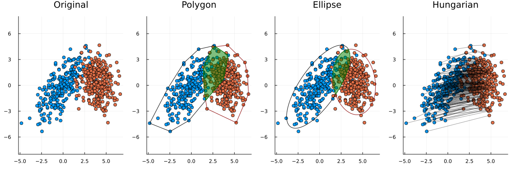

# 2D Similarities

Similarities between 2D data points.

   

Different metrics are used. In the following, `n` and `m` are the number of points in the first and second distribution respectively:

1. Hungarian method for the assignment problem.
    - Only recommended for non-normally distributed points.
    - Very slow: `O(n^4)` where `n ≤ m`.
2. Wasserstein metric for normal distributions.
    - Recommended.
    - Linear time complexity: `O(n+m)`.
    - Approximation of the average cost of the Hungarian solution for normally distributed points.
    - Readily extends to higher dimensions.
3. Ellipse: intersection over union of the 95% confidence interval ellipses orientated along the eigenvectors.
    - Not recommended.
    - Linear time complexity: `O(n+m)`.
    - Fails for similar distributions with no intersection.
1. Polygon: intersection over union of convex hulls
    - Not recommended.
    - Linear time complexity: `O(n*h1+m*h2)`.
    - Outliers significantly distort results.
    - Fails for similar distributions with no intersection.

## Dependencies

PolygonAlgorithms at [github.com/LiorSinai/PolygonAlgorithms](https://github.com/LiorSinai/PolygonAlgorithms).